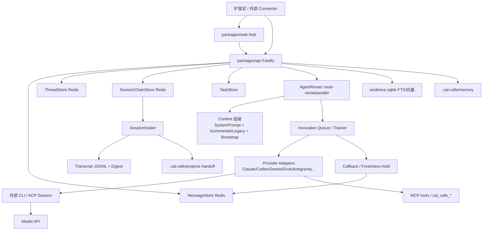
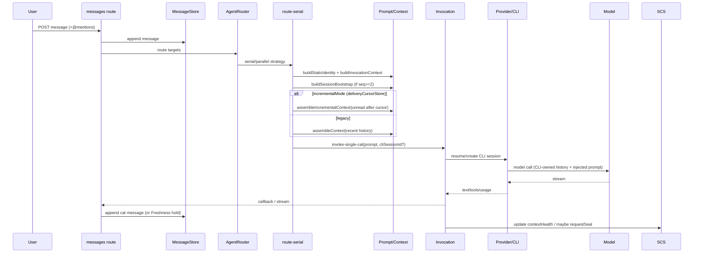
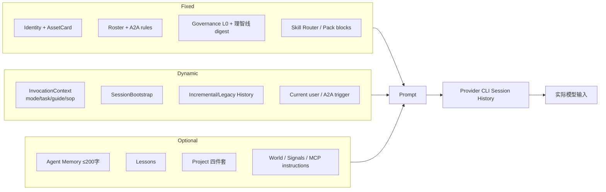
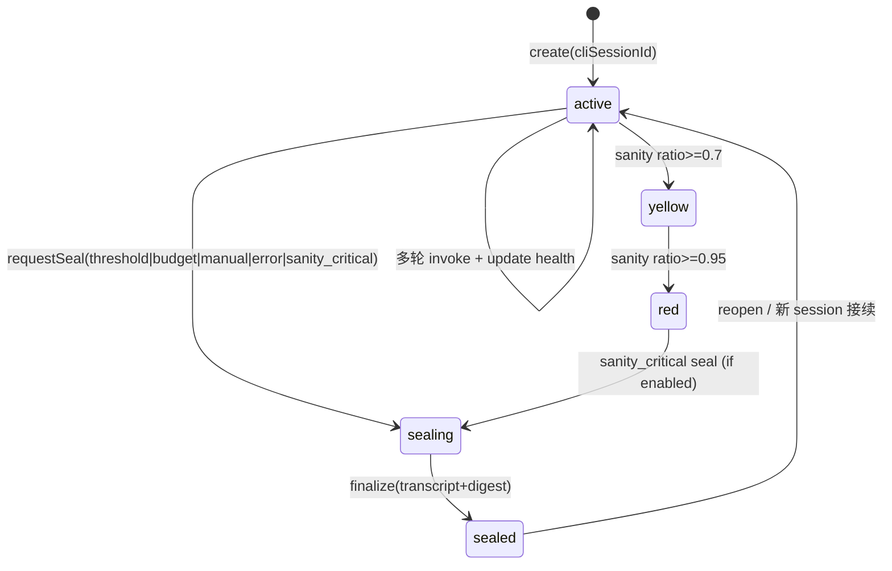
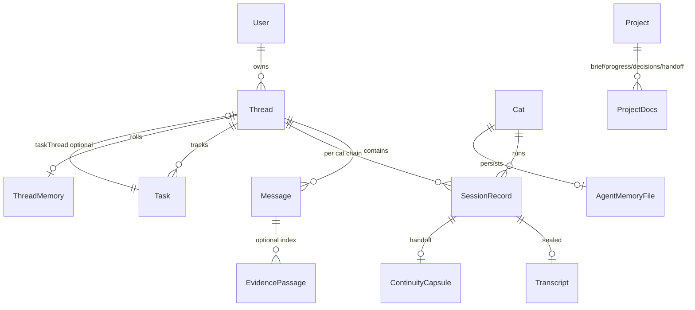

# Clowder 架构与上下文治理审计报告

> 审计日期：2026-07-22  
> 审计者：荧荧·探火（@grok）  
> 范围：只读审计，不改代码、不改生产数据  
> 项目根：本机 Clowder worktree  
> 运行方式（根 package.json）：`pnpm start` / `pnpm dev:direct` / `./scripts/start-dev.sh`  
> 默认本地端口约定：前端 3003、API 3004；生产 Redis 与 dev/test Redis 分离  
> 主存储：Redis（消息 / Session / Task 等运行时态）+ SQLite（evidence / summary / world / scheduler）+ 文件系统（`.cat-cafe/`、transcripts）

---

## 0. 执行摘要

### 最重要的 5 个结论

1. **Session 是真 Session，不是改名聊天记录。**  
   有 `SessionRecord`：`id`、`cliSessionId`、`seq`、`status(active|sealing|sealed)`、`contextHealth`、`sanityState`、`sealReason`、`continuityCapsule`。按 `userId + catId + threadId` 隔离，并可 seal → 新 session 接续。【代码 + 数据库】

2. **Clowder 注入的 Thread 历史不是“全频道无脑塞进 prompt”。**  
   主路径是 `assembleIncrementalContext`（delivery cursor 之后的未读）+ 预算；legacy 路径 `assembleContext` 默认 `maxMessages=20 / maxTotalTokens=2000`，实际 cat budget 可到 200 条 / 16 万 tokens。Channel 作为独立对象不存在；会话单元是 Thread。【代码 + 实测】

3. **真正会线性抬高模型输入的是 Provider CLI Session 续聊。**  
   每轮 resume 同一 `cliSessionId` 后，模型侧保留工具结果/对话历史。生产 Redis 中可见长 session 的 `contextHealth` 可接近窗口上限，`lastUsage.inputTokens` 累计可达数百万。Clowder 的 prompt 组装与 CLI 内部上下文是两层，不能混谈。【数据库】

4. **已有 Session 治理与理智线，但 Shared State 仍是“文档拼盘”，不是单一状态机。**  
   Session strategy（handoff/compress/hybrid）、SessionSealer、SessionBootstrap、理智线绿黄红、project handoff 四件套、ThreadMemory 都在；但缺少带 `state_version` 的统一 mission/current_phase 层，决策 supersedes 不完整。【代码】

5. **Context Builder 与 Message Store 已部分解耦，但固定开销与 feature flag 路径复杂。**  
   SystemPromptBuilder / ContextAssembler / route-helpers 分层清晰；deliveryOnly / content-free inbox / history-summary / context layers 多处 canary 开关，行为因 thread/env 不同而不同，可观测性不足时易误判为“全量注入”。【代码】

### 最大的 3 个风险

1. **P0：CLI Session 上下文膨胀 + 密封/接续失败时继续硬撑** → 质量衰减、账单暴涨、决策丢失。  
2. **P0：项目真相分散在聊天 / memory / progress / handoff-index**，多猫并行时状态漂移。  
3. **P1：Context 路径分叉过多（legacy / incremental / summary-active / content-free）**，缺统一 Context Policy 与 per-turn 来源面板，排障成本高。

### 最优先的 3 个改进

1. **可观测**：每轮 prompt 来源拆分（system / history / bootstrap / tools / memory / project）+ 展示 fillRatio / sanity 状态。  
2. **Context Policy 统一**：明确默认 = incremental + budget；legacy 仅 fallback；summary-active 晋升为默认长 thread 策略。  
3. **Shared State v1**：在 project 层引入 versioned current-state（mission/phase/tasks/decisions/blockers），与聊天解耦。

---

## 1. 调研范围与证据等级

| 范围 | 方法 | 证据等级 |
|------|------|----------|
| 目录与模块 | 文件系统遍历 | 【代码】 |
| 对象模型 | Store ports + shared types | 【代码】 |
| 消息→模型链路 | route-serial / route-parallel / invoke-single-cat | 【代码】 |
| Prompt 组成 | SystemPromptBuilder / ContextAssembler / SessionBootstrap | 【代码】 |
| 长频道 token | 本地 assembleContext 仿真 + Redis 真实 session 指标 | 【实测】【数据库】 |
| Session 生命周期 | SessionManager / SessionSealer / session-strategy | 【代码】【数据库】 |
| Shared State | projects 四件套 + ThreadMemory + TaskStore | 【代码】【文件】 |
| Redis 生产只读探测 | 生产 Redis 只读 SCAN/ZCARD/HGET | 【数据库】 |
| Raft 对比 | 以 Clowder 已实现能力 vs 审计 brief 中的 Raft 能力清单；未获得完整 Raft 产品源码 | 【推断】部分 【代码】 |

**禁止事项遵守情况**：未删除数据、未重置 Agent、未改配置、未提交代码。对生产 Redis 仅只读查询。

---

## 2. 项目目录与模块地图

```text
Clowder/  (本机 worktree)
├── packages/web/                 前端 Hub（thread UI、workspace panel）
├── packages/api/                 后端 API + Agent Runtime 编排
│   ├── src/routes/               HTTP：messages / sessions / callbacks / tasks
│   ├── src/domains/cats/         核心：routing、session、context、stores、providers
│   ├── src/domains/memory/       Evidence/Summary/FTS/向量相关
│   ├── src/domains/projects/     项目事实源读写
│   ├── src/domains/workspace/    Workspace 文件监听与安全
│   ├── src/config/               session-strategy、budgets、cat catalog
│   └── world.sqlite / evidence.sqlite / data/scheduler.sqlite
├── packages/shared/              共享类型与 catRegistry
├── packages/mcp-server/          MCP server 进程
├── .cat-cafe/                    运行时配置与持久记忆/项目档案
│   ├── cat-catalog.json
│   ├── memory/{catId}.md
│   └── projects/{projectId}/
├── cat-cafe-skills/              Skills / refs / shared-rules
├── data/                         audit-logs / logs / transcripts
├── bin/clowder                   CLI
└── scripts/                      start / redis / worktree
```

| 模块 | 路径 | 职责 | 与本次审计关系 |
|------|------|------|----------------|
| 前端 | `packages/web` | Thread、消息、Hub | 展示 session health / draft，非组装核心 |
| 后端 API | `packages/api/src` | 路由、编排、存储 | 主审计面 |
| Agent Runtime | `domains/cats/services/agents` | 唤醒、队列、provider 调用 | 消息→模型入口 |
| Prompt/Context | `domains/cats/services/context` | SystemPrompt / ContextAssembler | Context 真相 |
| Session | `domains/cats/services/session` | seal / bootstrap / sanity | 生命周期 |
| Message Store | Redis `cat-cafe:msg:*` | 消息持久化 | 历史来源 |
| Memory/Evidence | SQLite + files | 检索与摘要 | 按需材料 |
| Task | TaskStore（Redis/内存） | 毛线球 | 协作状态 |
| Workspace | `domains/workspace` + 文件系统 | 文件工作区 | 工具读盘，非全量注入 |

**关键词命中**：agent / session / thread / message / task / memory / workspace / context / prompt / token / summary / compaction / handoff / runtime / model / tool / retrieval / embedding 均有实现。  
**未命中为独立实体**：`Channel`（无一等 Channel 表/对象；Thread 即会话容器）。

---

## 3. Clowder 总体架构图



---

## 4. 核心对象模型

### 4.1 Model

```yaml
model:
  implementation_status: ✅ 多供应商，按 cat 绑定
  config_path:
    - .cat-cafe/cat-catalog.json
    - packages/api/src/config/cat-config-loader.ts
    - packages/api/src/config/cat-models.ts
    - packages/api/src/config/context-window-sizes.ts
  provider_adapter: domains/cats/services/agents/providers/*
  model_selection: getCatModel(env CAT_{CATID}_MODEL → registry → defaults)
  context_limit_source:
    - CLI 上报 modelUsage.contextWindow（Claude 优先 exact）
    - CONTEXT_WINDOW_SIZES fallback
    - ContextBudget.maxPromptTokens per cat
  token_metrics:
    - SessionRecord.contextHealth {usedTokens, windowTokens, fillRatio, source}
    - SessionRecord.lastUsage {inputTokens, outputTokens, cacheReadTokens}
    - prompt capture / runtimeContextBudget 快照（调试）
  evidence:
    - 【代码】context-window-sizes.ts
    - 【数据库】session HGET contextHealth / lastUsage
```

### 4.2 Agent

```yaml
agent:
  implementation_status: ✅ 持久身份猫（catId）
  config: cat-catalog.json + cat-template.json + assetCard
  identity_injection: SystemPromptBuilder.buildStaticIdentity
  tools: MCP cat_cafe_* + provider native tools（受 toolPolicy 控制）
  memory: .cat-cafe/memory/{catId}.md（每轮摘要 ≤200 字注入）
  workspace: 共享 monorepo / worktree；非每猫独占沙箱（默认）
  restart_retention: catalog/config + Redis session chain + memory files + transcripts
  evidence: 【代码】SystemPromptBuilder.ts:706+
```

### 4.3 Session

```yaml
session:
  implementation_status: ✅ 真 Session
  session_id: SessionRecord.id (UUID) + cliSessionId (provider)
  create_when: 猫在 thread 首次被唤醒或旧 session 已 seal 后新建
  not_per_message: 同一 active session 跨多轮消息复用
  binding: userId + catId + threadId
  states: active → sealing → sealed（可 reopen 路径存在）
  seal_triggers:
    - strategy threshold / budget_exhausted
    - manual / error
    - sanity_critical
    - hooks（session-hooks / PreCompact 相关）
  temp_state: Redis SessionChainStore + SessionManager pointer
  process_state: 不保留 shell 进程；CLI session 侧保留对话/工具历史
  reset: thread context reset boundary + seal + 新 cli session
  inherit_on_new_session: SessionBootstrap digest + task snapshot + thread memory + project handoff + sanity capsule
  evidence:
    - 【代码】SessionManager.ts, SessionSealer.ts, SessionBootstrap.ts, session-strategy.ts
    - 【数据库】cat-cafe:session:{id} hash；session-chain zset
```

真实生产样例（长 session / 编码猫，只读，已脱敏）：

```text
status=active seq=N
contextHealth={"usedTokens":"<~200k>","windowTokens":"<~260k>","fillRatio":"<~0.76>","source":"exact"}
lastUsage={"inputTokens":"<millions>","outputTokens":"<tens of thousands>","cacheReadTokens":"<majority cache hits>"}
continuityCapsule.continuationReason=threshold_seal
```

### 4.4 Channel

```yaml
channel:
  implementation_status: ❌ 无一等 Channel 实体
  actual: Thread 承担会话容器；UI “频道感”来自 thread 列表
  evidence: ThreadStore.ts 无 channelId 字段；消息只挂 threadId
```

### 4.5 Thread

```yaml
thread:
  implementation_status: ✅ 一等对象
  store: ThreadStore（Redis）
  messages: MessageStore 按 thread 时间线（ZSET cat-cafe:msg:thread:{id}）
  wake_history:
    - incremental: delivery cursor 后未读
    - legacy: assembleContext 最近 N 条
  summary:
    - ThreadMemoryV1 滚动摘要
    - ThreadHistorySummary（SQLite summary_segments，F004 canary）
  archive: soft delete / export 存在；非自动关闭归档机
  evidence: ThreadStore.ts, MessageStore.ts, route-helpers.ts
```

生产消息量抽样（Redis ZCARD，thread id 已脱敏）：

| thread | messages |
|--------|----------|
| 长频道 A | ~2500 |
| 长频道 B | ~2000 |
| 长频道 C | ~1900 |
| 中等频道 | ~500 |
| 本审计频道 | 个位数 |

### 4.6 Task

```yaml
task:
  implementation_status: ✅ 毛线球 TaskItem
  fields: id, title, status, ownerCatId, why, events[], kind, subjectKey, taskThreadId, automationState...
  binding: threadId / optional taskThreadId / sourceMessageId
  concurrency:
    - claimIfUnowned = CAS on ownerCatId ✅
    - status update 无通用 version/expectedVersion ❌
  evidence: TaskStore.ts claimIfUnowned
```

### 4.7 Memory

```yaml
memory:
  layers:
    - agent file memory: .cat-cafe/memory/{catId}.md
    - lessons: LESSONS.md 类公共踩坑
    - project facts: .cat-cafe/projects/*
    - thread memory: ThreadMemoryV1
    - evidence store: evidence.sqlite passages/FTS/embeddings
  auto_inject:
    - agent memory 摘要 always（有内容时）
    - lessons/project 受 toolPolicy + ContextLayerRouter + token gate
  isolation: per-cat 文件；project 共享；evidence 全局检索（有 redaction）
  growth_risk: memory 文件与 evidence 会增长；prompt 侧有截断/预算
  evidence: SystemPromptBuilder.ts agentMemory/lessons/project 注入段
```

### 4.8 Workspace

```yaml
workspace:
  implementation_status: ⚠️ 文件系统工作区 + Hub panel，不是独立 DB 表
  multi_agent: 默认共享同一 repo/worktree（风险：互相踩文件）
  session_reset: workspace 文件不随 session seal 清除
  evidence: domains/workspace/*
```

### 4.9 Shared State

```yaml
shared_state:
  mission: ⚠️ DispatchMissionPack / project brief 片段，非统一状态机
  current_phase: ⚠️ SOP/guide/bootcamp 各自有 phase
  active_tasks: ✅ TaskStore
  decisions: ⚠️ projects/decisions.md + ThreadMemory.decisions
  risks/blockers: ⚠️ 分散在文档与 task status=blocked
  artifacts: ⚠️ ThreadMemory.recentArtifacts + 聊天
  next_actions: ⚠️ 聊天/handoff 文本
  state_version: ❌ 无统一 version
  optimistic_lock: ⚠️ Task claim / Freshness hold version 有；项目状态无
  event_log: ⚠️ task.events / world_event_log / audit ndjson，不可重建完整 mission
```

---

## 5. 一次消息到模型调用的完整链路



关键入口文件：

| 步骤 | 文件 / 函数 |
|------|-------------|
| 消息入口 | `routes/messages.ts` |
| 路由 | `agents/routing/AgentRouter.ts` |
| 串行组装 | `route-serial.ts`（`incrementalMode` ~L380） |
| 增量上下文 | `route-helpers.assembleIncrementalContext` |
| 身份 prompt | `SystemPromptBuilder.buildStaticIdentity / buildInvocationContext` |
| 调用 | `invocation/invoke-single-cat.ts` |
| Session 健康/理智线 | `SessionSanityMonitor` + session-strategy `shouldTakeAction` |
| 密封 | `SessionSealer.requestSeal / finalize` |

---

## 6. Prompt / Context 的真实组成



真实组装顺序（serial + incremental 主路径，代码 `route-serial.ts`）：

```text
Prompt =
  buildInvocationContext(...)          // 动态调用上下文
+ catModePrompt                        // 可选 mode
+ bootstrapContext                     // Session #2+ 摘要/任务/thread memory
+ mcpInstructions                      // 可选
+ inc.contextText                      // 未读/摘要/inbox 元数据
+ explicitMessage                      // 当前触发消息（若未包含）
---
staticIdentity 通常作为 system/session 级身份注入（provider 相关）
---
Provider CLI 内部另有：既有对话轮次 + tool results（不在 Clowder prompt 字符串里完整可见）
```

### 6.1 固定开销

- 身份、资产卡、协作规则、shared-rules digest、理智线 digest、CLI 工作纪律。  
- Skill Router / Pack / Reviewer 段按配置追加。  
- 【推断】完整 staticIdentity 常达数千～上万 tokens（随 roster/skills 膨胀）；本轮未做全量逐 token 测量。

### 6.2 会话历史

| 模式 | 行为 | 增长特性 |
|------|------|----------|
| incremental（默认有 deliveryCursor） | 只注入 cursor 后未读（可过滤自身/progress/system） | 与未读量相关，不与全 thread 线性 |
| content-free inbox（canary） | 只注入 unread 元数据 | 几乎固定 |
| deliveryOnly（canary） | summary + 少量 anchors + 当前触发 | 近似固定 + 摘要 |
| legacy assembleContext | 最近 N 条 + token budget | 有上限，非无限线性 |
| CLI resume | provider 侧全会话历史 | **主增长源** |

### 6.3 项目材料

- `readProjectProgressForPrompt()` → brief/progress/decisions/handoff-index 片段  
- ContextLayerRouter 可把 L2 project context 延后（讨论轻量消息）  
- SessionBootstrap 会注入 Durable Project Handoff 索引

### 6.4 工具与文件

- 工具 Schema 主要在 provider/MCP 侧；Clowder 注入 MCP 使用说明  
- 工具结果进入 **CLI session 历史**，下一轮不一定再由 Clowder 重注全文  
- 大文件默认靠 agent 主动 read，不自动全量塞 prompt

### 6.5 检索内容

- Evidence search（SQLite FTS/embedding）按需  
- SessionBootstrap 可基于 thread title 做 500ms 超时 recall  
- cat_cafe_search_evidence / fetch_thread_history 工具按需

---

## 7. 长频道 Token 增长验证

### 实验步骤

1. **代码路径确认**：incremental vs legacy 预算参数。  
2. **本地仿真**：复用 `estimateTokens` + assembleContext 规则，对不同 history 规模测注入 tokens。  
3. **生产只读观测**：Redis session `contextHealth` / `lastUsage`；thread ZCARD。  
4. **未做**：对本机发真实测试消息改写生产 thread（避免污染）。

### 实验数据（Clowder 注入层仿真）

| 预算配置 | 数据集 | 注入消息数 | 估算 tokens |
|----------|--------|------------|-------------|
| legacy 默认 20/2k | 5 short | 5 | 95 |
| legacy 默认 20/2k | 200/500 short | 20 | 335 |
| legacy 默认 20/2k | 50/200 fat(2k) | 9 | 1815（触顶） |
| cat budget 200/160k | 200 short | 200 | 3215 |
| cat budget 200/160k | 200 fat(2k) | 200 | 40015 |
| unread-only 1..100 short | unseen=1→100 | 1→100 | 31→1615 |

### 生产 Session 指标（注入层之外）

| 指标 | 值 | 含义 |
|------|-----|------|
| usedTokens | ~200k / ~260k | 单轮上下文填充 ~76% |
| lastUsage.inputTokens | 数百万 | 该 session 累计输入（含多轮） |
| fillRatio 抽样 | 0.05 ~ 0.85 | 不同 session 差异大 |
| 长 thread 消息数 | 最多 2500+ | 消息库增长 ≠ 每轮全量注入 |

### 结论

1. **Channel/Thread 消息数 ≠ 每轮 Clowder prompt 线性全量注入。** 有 cursor / maxMessages / maxContextTokens。  
2. **Thread 相对独立**：session 按 thread 隔离，不跨 thread 混上下文（SessionManager 注释明确）。  
3. **历史默认不是全量**；是未读窗口或最近 N + budget。  
4. **摘要替换存在但 canary**：history-summary / deliveryOnly / ThreadMemory，不是全局默认必开。  
5. **按需检索存在**（evidence / history fetch tools）。  
6. **固定开销**：身份治理 + skill + bootstrap。  
7. **会持续增长的部分**：  
   - CLI session 内多轮 tool/对话（主）；  
   - 未读堆积未 ack 时 incremental 窗口；  
   - project/memory/lessons 文本变长；  
   - 未 seal 的 session fillRatio。

**直接回答审计焦点：**  
“长频道是否导致每轮输入 Token 持续增长？”——  
- **若问 Clowder 组装的 history 段：默认否（有上限/增量）。**  
- **若问模型实际输入：在长 session 内是，主因是 CLI 续聊而非 thread 全量重放。**

---

## 8. Session 生命周期与上下文过载



| 机制 | 现状 |
|------|------|
| Context 使用量监控 | ✅ contextHealth |
| Context Limit | ✅ windowTokens + maxPromptTokens |
| 自动 seal | ✅ shouldTakeAction |
| 理智线 | ✅ green/yellow/red（分母 sanityLine，默认约 200k 量级，可配置） |
| 与 ContextHealth 关系 | 两套尺子：window 防硬溢出；sanity 防软质量衰减 |
| 自动停止 | ⚠️ seal/换班，不是简单 kill；依赖开关 CAT_CAFE_SANITY_SEAL_ENABLED |
| 用户 Reset | ⚠️ thread reset boundary / seal API 存在；体验是否完整 UI 化未全量验收 |

---

## 9. Compaction / Reset / Handoff 机制

| 机制 | 实现 | 评价 |
|------|------|------|
| Provider compress | strategy=`compress`/`hybrid`（hook-capable 主要 anthropic） | CLI 压缩信号驱动 |
| Platform seal handoff | 默认 strategy=`handoff` | 主流 |
| Transcript + digest | SessionSealer.finalize | extractive / generative |
| Bootstrap 注入 | SessionBootstrap ≤2000 tokens | 有硬顶，防套娃膨胀 |
| Project handoff 文件 | writeContextHandoffForPromptProjects | 持久 |
| 理智线交接包 | HandoffCapsuleGenerator + 回述指令 | red 区强制 |
| ThreadHistorySummary compaction | SummaryCompactionTask + SQLite segments | 基础设施在，路由 canary |
| 压缩后是否仍注入原历史 | CLI 侧由 provider 决定；Clowder 侧 seal 后不再 resume 旧 cliSession | 需分侧理解 |

**当前机制归属（可多选）：**

```text
✅ 平台自动密封 + 新 Session 交接（主）
✅ 模型/CLI 压缩（可选 hybrid/compress）
✅ 滚动 ThreadMemory / 摘要段（部分）
✅ 人工/hook 触发 seal
❌ 无压缩（不属实）
⚠️ 截断旧消息（Clowder 注入层有 cap，不等于丢弃存储）
```

**Handoff 套娃风险：**  
Bootstrap 只取 **最近一个 sealed session** 的 digest + 有 token 硬顶；project handoff-index 是索引不是全文堆叠。  
**残留风险**：project handoff-index 自动追加条目过多时，索引本身变长（本线程上下文已见截断提示）。

---

## 10. Shared State 能力评估

| 目标字段 | 状态 | 落点 |
|----------|------|------|
| mission | ⚠️ | DispatchMissionPack / brief.md |
| current_phase | ⚠️ | SOP / guide / bootcamp 分散 |
| active_tasks | ✅ | TaskStore |
| decisions | ⚠️ | decisions.md / ThreadMemory |
| risks | ⚠️ | 文档/聊天 |
| blockers | ⚠️ | task=blocked + 文本 |
| artifacts | ⚠️ | ThreadMemory.recentArtifacts |
| next_actions | ⚠️ | handoff/聊天 |
| state_version | ❌ | 无 |
| optimistic lock | ⚠️ | task claim / freshness version only |
| append-only rebuild | ⚠️ | 有事件碎片，无统一投影 |

**判断：** Shared State **有相近能力但不完整**。多猫读到的“同一事实”依赖文件约定与自觉回写，不是强一致状态层。

---

## 11. 本地数据存储结构



| 数据 | 位置 |
|------|------|
| 消息 | Redis `cat-cafe:msg:*` / `cat-cafe:msg:thread:*` |
| Thread / participants | Redis `cat-cafe:thread:*` |
| Session | Redis `cat-cafe:session:{id}` + `session-chain:{cat}:{thread}` |
| Task | Redis TaskStore（亦有内存实现） |
| Evidence / summary | `packages/api/evidence.sqlite` |
| World RP | `packages/api/world.sqlite` |
| Scheduler | `packages/api/data/scheduler.sqlite` |
| Agent memory / projects | `.cat-cafe/memory`, `.cat-cafe/projects` |
| Transcripts / logs | `data/transcripts`, `data/logs`, `data/audit-logs` |
| 配置 | `.cat-cafe/cat-catalog.json`, `.env` |

| 能力 | 现状 |
|------|------|
| 本地优先 | ✅ |
| Git | 源码/项目文件 ✅；Redis 运行时态需备份脚本 |
| 向量库 | evidence embedding 相关表 ✅（轻量） |
| 导出 | thread export 路由存在 |
| 删除 | soft delete / tombstone |
| 多用户强隔离 | ⚠️ 默认单用户取向 + thread 级 |
| 审计日志 | audit ndjson ✅ |
| 敏感加密 | ⚠️ 未在本轮完整证明 at-rest 加密 |

---

## 12. 缺陷清单

### 12.1 P0

```yaml
issue:
  severity: P0
  title: CLI Session 上下文膨胀与质量衰减
  current_behavior: 同一 cliSessionId 多轮续聊，usedTokens 可逼近 window；累计 inputTokens 达数百万
  evidence: Redis session lastUsage.inputTokens 达数百万，usedTokens 可接近窗口上限
  impact: 幻觉、丢约束、费用上升、seal 前硬撑
  reproduction: 长任务同猫同 thread 连续多轮工具调用不 seal
  suggested_direction: 强化 sanity seal 默认与可观测；turnBudget 提前 warn；关键任务强制短 session
```

```yaml
issue:
  severity: P0
  title: 项目 Shared State 非单一真相源
  current_behavior: 决策/进度散落在聊天、memory、progress、handoff-index
  evidence: SystemPrompt 多源注入；无 state_version
  impact: 多猫并行互相覆盖或读到过期事实
  reproduction: 两猫同时改同一需求结论只写在聊天
  suggested_direction: project current-state.json + version/CAS + supersedes
```

### 12.2 P1

```yaml
issue:
  severity: P1
  title: Context 路径分叉过多且 canary 默认不统一
  current_behavior: incremental / legacy / content-free / deliveryOnly / summary-active 并存
  evidence: route-serial.ts, route-helpers.ts, ContextLayerRouter env flag
  impact: 排障困难；“是否全量注入”结论依赖线程配置
  suggested_direction: Context Policy 单一默认 + per-turn source panel
```

```yaml
issue:
  severity: P1
  title: Task 非 claim 更新缺少乐观锁
  current_behavior: claim CAS 有；status 普通 update 无 version
  evidence: TaskStore.ts
  impact: 并发状态机互相覆盖
  suggested_direction: task.version + expectedVersion
```

```yaml
issue:
  severity: P1
  title: 固定 prompt 开销大且难计量
  current_behavior: 身份/规则/技能菜单常驻；缺默认 UI 展示分项 tokens
  evidence: SystemPromptBuilder 体量大；runtimeContextBudget 主要内部
  impact: 有效业务上下文被固定段挤压
  suggested_direction: prompt 分项 metrics 默认落库 + Hub 展示
```

```yaml
issue:
  severity: P1
  title: handoff-index 可能无限追加
  current_behavior: context-handoff 自动写入项目索引
  evidence: 本 session 注入的 handoff-index 已出现截断
  impact: 接续噪音、索引本身 token 化
  suggested_direction: 索引保留最近 N + 归档冷数据
```

### 12.3 P2

```yaml
issue:
  severity: P2
  title: 无 Channel 一等模型导致术语漂移
  current_behavior: 文档/产品说频道，实现只有 Thread
  impact: 审计与设计沟通成本
  suggested_direction: 统一术语或引入 Channel 容器（可选）
```

```yaml
issue:
  severity: P2
  title: Session 状态对终端用户不够显眼
  current_behavior: 数据在 Redis/API，前端是否完整暴露未作为验收默认
  impact: 用户不知道该换班了
  suggested_direction: thread 内 session chip：fill/sanity/seq
```

```yaml
issue:
  severity: P2
  title: Workspace 多猫共享无租约
  current_behavior: 同 worktree 并行改文件
  impact: 文件争用
  suggested_direction: file lease / worktree-per-task 策略产品化
```

---

## 13. 与 Raft 机制对比

> 说明：本轮未拿到完整 Raft 产品源码；对比以审计 brief 的能力清单 + Clowder 已实现代码为准。Raft 侧描述标【推断/产品能力清单】。

| 能力 | Clowder | Raft（能力清单视角） | 差距 |
|------|---------|----------------------|------|
| Inbox Pull | ✅ content-free inbox + check_inbox | ✅ 未读拉取 | 接近；Clowder 仍 canary |
| Held Draft | ✅ FreshnessHold + expectedVersion | ✅ held draft | 接近（F193） |
| Session Reset | ✅ seal/reset boundary/reopen | ✅ 明确 reset | Clowder UI/心智可再产品化 |
| Compaction | ⚠️ CLI compress + summary segments + memory | ✅ 平台统一 compaction | Clowder 分叉、非全局统一 |
| Task | ✅ 毛线球 + CAS claim | ✅ Task | 缺通用 version |
| Search | ✅ evidence FTS/embedding + thread history fetch | ✅ Search | 接近 |
| Thread | ✅ 一等 | ✅ | 接近；无 Channel |
| Memory | ✅ 分层文件/thread/evidence | ✅ | 注入策略需更硬隔离 |
| Workspace | ⚠️ 文件工作区 | ✅ 更强工作区隔离（推断） | Clowder 共享 repo 风险更高 |
| Context Metrics | ✅ session health；⚠️ 分项不足 | ✅ 更完整 metrics（推断） | 需默认可见 |
| 理智线 | ✅ 已实现绿黄红 | ✅ | 接近；阈值校准仍关键 |
| Handoff | ✅ seal+bootstrap+project handoff | ✅ | 索引治理需加强 |
| Shared State | ⚠️ 文档拼盘 | ✅ 结构化状态（推断） | **主要差距** |
| 乐观锁 | ⚠️ 局部（claim/freshness） | ✅ 更广（推断） | 项目状态/任务更新需补齐 |

---

## 14. 建议的改造路线

### Phase 1：可观测

- 每轮记录：`prompt_parts_tokens{}`、`history_mode`、`session.fill/sanity`、`cliSessionId/seq`  
- Hub 展示 session chip + “本轮上下文来源”  
- 长 thread 自动告警：未读堆积 / fill>warn / sanity yellow

### Phase 2：Context Builder

- 固化默认 Policy：`incremental + budget + optional summary-active`  
- 退役 silent legacy 全历史拼装  
- content-free / deliveryOnly 从 canary 毕业或明确线程开关 UI  
- ContextLayerRouter 默认 on 并补测试矩阵

### Phase 3：Session 治理

- sanity seal 生产默认与阈值看板  
- hybrid/compress 仅 hook-capable 可见  
- bootstrap/handoff-index 冷热分层  
- 强制短 session 任务模板（高风险工程）

### Phase 4：Shared State

- `projects/{id}/state.json`：mission/phase/tasks/decisions/blockers/artifacts/next + `version`  
- 更新 API：CAS `expectedVersion`  
- prompt 只注入 current-state 摘要，细节按需读

### Phase 5：并发与自动交接

- Task 全字段 version  
- Workspace file lease  
- 红区自动交接 + 接班回述门禁产品化  
- 多猫并行写共享状态冲突面板

---

## 15. 无法确认的问题

1. **Raft 产品内部实现细节**（无源码/运行实例对照）——对比中 Raft 列为能力清单级。  
2. **各 provider 在 compress 后是否仍保留 tool 原文**——属 CLI 黑盒，需专项抓 prompt-capture。  
3. **全量 staticIdentity 的精确 token 分布**——本轮未对每个 cat 做生产抓包。  
4. **content-free / deliveryOnly / summary-active 在生产默认覆盖了多少 thread**——依赖 env allowlist，未做全集统计。  
5. **多用户权限隔离是否满足企业级**——当前更像单主用户本地协作。  
6. **at-rest 加密与备份 RPO/RTO**——有备份脚本迹象，未做演练验证。  
7. **前端是否完整展示 contextHealth/sanity**——后端字段存在，UI 覆盖率未逐页验收。

---

## 16. 证据索引

### 文件

- `packages/api/src/domains/cats/services/context/ContextAssembler.ts`
- `packages/api/src/domains/cats/services/context/SystemPromptBuilder.ts`
- `packages/api/src/domains/cats/services/context/ContextLayerRouter.ts`
- `packages/api/src/domains/cats/services/agents/routing/route-serial.ts`
- `packages/api/src/domains/cats/services/agents/routing/route-helpers.ts`
- `packages/api/src/domains/cats/services/agents/routing/context-transport.ts`
- `packages/api/src/domains/cats/services/session/SessionManager.ts`
- `packages/api/src/domains/cats/services/session/SessionSealer.ts`
- `packages/api/src/domains/cats/services/session/SessionBootstrap.ts`
- `packages/api/src/domains/cats/services/session/SessionSanityMonitor.ts`
- `packages/api/src/config/session-strategy.ts`
- `packages/api/src/config/cat-budgets.ts`
- `packages/api/src/config/hierarchical-context-config.ts`
- `packages/api/src/config/context-window-sizes.ts`
- `packages/api/src/domains/cats/services/stores/ports/{MessageStore,ThreadStore,SessionChainStore,TaskStore}.ts`
- `packages/api/src/domains/cats/services/agents/freshness/FreshnessEgressGate.ts`
- `packages/api/src/domains/memory/ThreadHistorySummaryStore.ts`
- `packages/api/src/routes/session-hooks.ts`
- `.cat-cafe/projects/*/`, `.cat-cafe/memory/*`

### 函数

- `assembleContext` / `assembleIncrementalContext` / `buildSystemPrompt` / `buildStaticIdentity`
- `buildSessionBootstrap` / `shouldTakeAction` / `classifySanityState`
- `SessionSealer.requestSeal` / `finalize`
- `claimIfUnowned`

### 数据表 / Key

- Redis：`cat-cafe:msg:*`, `cat-cafe:msg:thread:*`, `cat-cafe:session:*`, `cat-cafe:session-chain:*`
- SQLite：`evidence.sqlite`（summary_segments / evidence_* / embedding_meta）
- SQLite：`world.sqlite`（worlds / event_log）

### 日志

- `data/logs/api/api.log`（存在，本轮未展开全量）
- `data/audit-logs/audit-*.ndjson`

### 实验

- 本地 assembleContext token 仿真（见 §7）
- Redis 只读：thread ZCARD、session HGET contextHealth/lastUsage

---

## 附录 A：给第二轮方案会的直接判断（审计焦点清单）

| 问题 | 结论 |
|------|------|
| 长频道是否线性涨 token？ | **注入层默认否；CLI session 层是** |
| Session 是真 Session 吗？ | **是**（状态机 + cliSessionId + seal 链） |
| Context Builder 与 Message Store 解耦吗？ | **部分解耦**（组装层独立，但仍直接读 store） |
| 隐性全量历史注入？ | **非默认**；legacy/大 budget/未读堆积可近似变重 |
| Compaction 只有摘要无状态版本？ | **摘要+digest 为主；无统一 state_version** |
| Handoff 会层层套娃吗？ | **有硬顶，风险可控；索引膨胀仍需治** |
| Shared State 插哪一层？ | **Thread 之下、Prompt 之上：Project Current State 服务** |
| P0 先修什么？ | **Session 膨胀治理可观测 + Shared State 版本化** |

---

*报告结束。路径：仓库根目录 `clowder-architecture-context-audit.md`*
