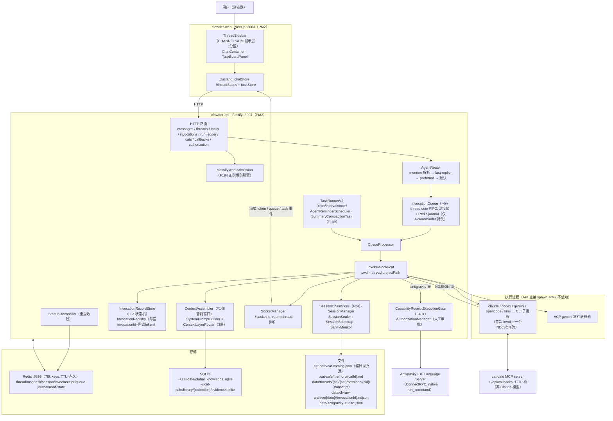

# Clowder × Raft 能力拆解与映射调研报告

> 调研方式：6 个并行只读调研线（Agent 身份 / Session-Run-进程 / 消息模型 / 上下文-记忆-共享状态 / 唤醒-任务-恢复 / 运行时-权限-可观测），全部结论要求 `文件:行号` 证据；关键承重结论（A2A 行首 @、Task 状态枚举、Session 状态、CLI 权限模式、用户队列不持久化）经第二轮人工抽查核实。
> 路径缩写：`api/` = packages/api/src，`shared/` = packages/shared/src，`web/` = packages/web/src。
> 本文遵守调研限制：文档（含 ADR、feature docs、根目录两份现成报告）只作线索，一律回源码核实；无法确认的内容明确标记在 §10。

---

## 1. 执行摘要

**总体结论：Clowder 的底层能力比"聊天室 + 拼接 CLI"要扎实得多，但领域模型是"单实体 + 标志位"风格，距 Raft 式分层协作模型缺三块硬骨头。**

已经扎实的（超出预期）：

1. **Session/Run 双层模型已存在且工程化程度高**——CLI session（可 `--resume`）之上有 Redis SessionRecord 链（F24），封存（seal）有 6 种触发原因、有 transcript 落盘、有 handoff capsule；一次执行有独立 InvocationRecord（Lua 原子状态机、永久保存、可查询、原始 NDJSON 按天归档）。
2. **聊天历史之外的结构化共享状态已存在**——任务板（Redis Lua CAS 原子认领）、evidence SQLite（单写者 FIFO 队列）、项目四件套文件、MarkerQueue。"缺少共享状态"这个预设问题不成立，成立的是"共享状态分散且写模型不统一"。
3. **执行可观测已具雏形**——InvocationRecord 7 段 phase + RunLedger 时间线聚合 API + F128 成本日聚合 + 工具调用计数。

三块硬骨头（Raft 映射的主要缺口）：

1. **会话容器只有一层**：后端只有 Thread 一种实体，Channel/DM/大厅/分支全靠 `isDM`、`relation` 等标志位微分；Workspace 概念不存在（该词已被文件系统工作区域占用）。
2. **唤醒是"被投递才动"**：唯一唤醒入口是消息路由；inbox 是执行中拉取式；无订阅、无事件总线（无 BullMQ/streams/pub-sub）；**用户来源的排队消息不持久化，重启即丢且用户不可见**（本报告最高优先级问题）。
3. **权限是"门禁很严、屋里裸奔"**：capability receipt（F401）一次性凭证 + fail-closed 设计严谨，但只覆盖 1 个 executor × 1 只猫 × 1 个 thread 的金丝雀三元组；所有 CLI 子进程以 `bypassPermissions` / `danger-full-access` 裸跑，无沙箱，隔离靠约定。

---

## 2. 当前架构图（仅含已确认代码）

要点：PM2 只管 api/web 两个主进程；CLI 子进程由 API 进程内闭包跟踪（pid + exit 监听），无全局子进程注册表（api/utils/cli-spawn.ts:244-253 在进程 exit 时 SIGKILL 未退出子进程；SIGKILL 杀 API 时该钩子不执行，子进程短暂孤儿化）。

---

## 3. 核心对象定义表（输出二）

| 对象 | 当前代码定义 | 生命周期 | 持久化位置 | 与其他对象的关系 | 当前问题 |
|---|---|---|---|---|---|
| **Agent Identity** | `CatConfig`（shared/types/cat.ts:58-）；三层文件：cat-template.json（git, 模板/breed/variant）→ `.cat-cafe/cat-catalog.json`（运行时唯一可写真源，.gitignore:52）；cat-config.json 为迁移遗留死文件 | 启动 bootstrap 生成/加载；POST /api/cats 动态创建（前端 autoSlug，中文名→`cat-{random}`，hub-cat-editor.model.ts:345-359）；DELETE 即物理移除条目 | catalog JSON 文件 | catId（branded, shared/types/ids.ts:13,46）被 message.sender、TaskEvent.catId、session-chain key 引用 | ① 删猫不迁移历史→孤儿引用；② `loadCatConfig()` 无参=模板+catalog 深合并 vs 显式路径=纯 catalog 两种视图并存（cat-config-loader.ts:398-426 vs 478-578）；③ reconcile 保留非 catalog 管理的内存 extraCats，可与文件漂移 |
| **Agent Instance** | `AgentService`（接口仅 `invoke()`，agents/types.ts:316-324）按 catId 注册于 AgentRegistry；`CatSupervisor` 状态机（注释自认 "does not keep model processes alive yet"，在册即 online_idle） | 与 API 进程同生命周期（内存态） | 无（CatRegistry 为内存 Map，shared/registry/CatRegistry.ts:17-90） | 1 identity : 1 service 实例；invoke 时产生 Run | "实例"实为无状态适配器，猫的"在线状态"是形式值，不反映真实进程 |
| **Session** | 双层：`cliSessionId`（CLI 上报 session_init）+ `SessionRecord`（shared/types/session.ts:13，状态 active→sealing→sealed），F24 链 = ZSet `session-chain:{catId}:{threadId}` | 创建于首个 session_init（invoke-single-cat.ts:1587-1683）；`--resume` 复用（providers/ClaudeAgentService.ts:243-244）；封存 6 因（threshold/sanity_critical/cli_session_replaced/overflow_circuit_breaker/manual/reaper 收割）；**无暂停、无删除**（TTL 0 永久） | Redis Hash `session:{id}` + 封存后 transcript 落盘 data/threads/…（TranscriptWriter.ts:156-170） | 维度是 **cat×thread**（不跨 thread）；跨代靠 SessionBootstrap 注入前代摘要/handoff capsule（预算 2000 tokens） | Session 被绑死在单 thread 内，无"猫的跨话题工作 session"概念 |
| **Run** | 两层：`InvocationRecord`（Redis `invoc:{uuid}`，状态 queued→running→succeeded/failed/canceled，Lua 原子迁移，RedisInvocationRecordStore.ts:64-105）+ 每猫 `invocationId`（InvocationRegistry.ts:117-140，TTL 2h，注入子进程 env 作回调凭证），经 parentInvocationId 关联 | route 级调度创建；终态永久保存；GET /api/invocations/:id 可查 | Redis（invoc 5363 条实测）+ 原始流归档 data/cli-raw-archive/{date}/{invocationId}.ndjson（CliRawArchive.ts） | 1 Run ↔ 1 CLI 子进程；N Run → 1 Session（同 cliSessionId 连续 resume）；Run.usageByCat 记 token/费用 | 两套 ID 语义分工（调度记录 vs 回调凭证）未在文档层面统一，易混淆 |
| **Process** | `spawnCli()`（api/utils/cli-spawn.ts:79-）每次 invoke spawn 一个 CLI 子进程；例外：ACP gemini 常驻池 | 默认超时 30min（输出即重置）+ F118 liveness 探针 + SIGTERM→3s→SIGKILL；API 正常退出时统杀 | 无 PID 持久化 | PM2 只管 api/web 主进程，不感知 CLI 子进程 | API 被 SIGKILL 时子进程孤儿化且重启后无法认领（无注册表可寻） |
| **Conversation** | **不存在独立实体**——代码注释中"对话"即 Thread 的别名（ThreadStore.ts 头注释） | — | — | — | 概念缺位由 Thread 单实体全兜 |
| **Thread** | `Thread`（ports/ThreadStore.ts:128-191）约 30 字段：projectPath/participants/relation(inline_reply\|edit_branch)/isDM/phase/preferredCats/participatingCats/threadMemory/routingPolicy/deletedAt(软删)… | POST /api/threads、/threads/dm（按 isDM+participatingCats 查重复用）；消息孤儿时可自愈重建（RedisThreadStore.ts:925-971）；软删 + tombstone 防复活 | Redis Hash `cat-cafe:thread:{id}` + participants Set + activity Hash + 用户 ZSet 索引；TTL 永久（实测 -1，LL-048"用户可见状态禁默认 TTL"） | 挂 projectPath（决定执行 cwd）；DM=isDM+单猫；分支=relation+extra.slockThread；Channel/大厅=前端展示层过滤（ThreadSidebar.tsx:77-81,511-513） | 一个实体承载频道/DM/大厅/分支/任务讨论 5 种语义，靠标志位微分；无成员权限模型 |
| **Task** | `Task`（shared/types/task.ts:12）：status `todo\|doing\|in_review\|blocked\|done\|failed` + failureClass 7 类 + kind(work\|pr_tracking) + threadId/taskThreadId/ownerCatId/sourceMessageId/parentTaskId/retryOf + 内嵌 events 账本 | F194 `admitWorkMessage` 自动收纳（work-admission.ts:90 正则规则引擎）或 API 创建；`upsertBySubject` 幂等（subjectKey=`work-intake:{threadId}:{messageId}`） | Redis `task:{sortableId}` Hash + thread/kind/subject 三索引（实测 457 条） | `linkTaskThreadIfAbsent` 原子绑定任务讨论分支 thread；`claimIfUnowned` Lua CAS 认领（RedisTaskStore.ts:352-377） | 自动收纳按 thread 灰度（CLOWDER_AUTO_TASK_THREAD_THREADS 仅 2 个）；task 状态与 invocation 状态无联动 |
| **Shared State** | 四处分立：① TaskStore（CAS 认领）② evidence SQLite（**EvidenceWriteQueue 单写者 FIFO**，evidence-write-queue.ts:6-21）③ 项目四件套 `.cat-cafe/projects/{id}/`（brief/progress/decisions/handoff-index，append 无锁）④ MarkerQueue（docs/markers/*.yaml，git 为真源） | 各自独立 | Redis / SQLite / 文件 / git | 均跨猫可见 | 无统一"结构化共享 KV"抽象；文件路径无并发控制；写模型三种并存 |
| **Memory** | 五层：① 个体 `.cat-cafe/memory/{catId}.md`（注入时压 ≤200 字摘要）② 共享 LESSONS.md ③ 项目四件套 ④ thread 级 threadMemory 滚动摘要 ⑤ 全局 global_knowledge.sqlite（FTS5+向量, RRF 融合） | AutoWriter 回写；promotion 三档 off/shadow/enforce（AgentMemoryPromotionGate.ts:54-62，生产=shadow：评估打点但仍直写） | 文件 + SQLite + Redis | sanity seal 前强制 await 记忆回写 | enforce（候选队列+人审）未启用；个体记忆无结构化 schema |

---

## 4. 十六个核心问题逐条回答（代码证据）

### Q1 Clowder 当前如何定义 Agent？
**三层文件 + 内存注册表。** cat-template.json（git 跟踪）提供 roleTemplates/clientDefaults/breeds——breed=品种（外观+人格+提及别名），breed.variants[]=同品种不同模型分身，每 variant 有独立 catId/clientId/defaultModel/cli 参数/contextBudget/voiceConfig。运行时真源是 `.cat-cafe/cat-catalog.json`（CRUD 全落此，git 忽略）；cat-config.json 是 provider→clientId 改名迁移（cat-catalog-store.ts:47-51）前的死快照，仅剩脚本正则引用。启动时 `toAllCatConfigs()` 把每个 variant 展平为独立 CatConfig 注册进内存单例 CatRegistry（cat-config-loader.ts:478-578，catId 重复直接启动失败）。动态建猫（POST /api/cats → runtime-cat-catalog.ts:322-341 原子写入+回读校验）持久化、重启仍在；`cat-9eoshf3q` 即中文名"规划大师"无法转 ASCII slug 时前端生成的随机 ID。

### Q2 Agent 配置、实例和运行进程是否混合？
**类型层边界清晰，数据层有两处混同。** 配置=CatConfig；实例=AgentService（仅 invoke() 的无状态适配器）+ CatSupervisor（自认不保活进程，在册即 online_idle）；进程=每次 invoke 一个 CLI 子进程，PID 不与猫绑定。混同点：① 配置读取有"模板+catalog 深合并"与"纯 catalog"两种视图并存，CatRegistry 里没有 template-only 的猫，但 roster/effort 读合并视图；② reconcileCatRegistry（routes/cats.ts:538-549）保留非 catalog 管理的内存 extraCats，CRUD 后内存与文件可不一致。

### Q3 Session 的准确含义？
**双层。** 底层"CLI session"：CLI 自己的会话（cliSessionId，session_init 事件上报，支持 --resume）。上层"SessionRecord"：Clowder 按 **cat×thread** 维护的记录（shared/types/session.ts:13），同一猫在同一 thread 的历代 session 以 seq 串成链（ZSet `session-chain:{catId}:{threadId}`，RedisSessionChainStore.ts:5-9），活跃指针 + cliSessionId 反查索引。另有 SessionManager 只存 `userId:catId:threadId → cliSessionId` 指针，按 thread 隔离防跨线程污染。

### Q4 Session 创建/恢复/暂停/终止/销毁规则？
创建：首个 session_init 触发（invoke-single-cat.ts:1587-1683）。恢复：`--resume <cliSessionId>`（providers/ClaudeAgentService.ts:220,243-244），sessionId 权威值取 active SessionRecord。**无暂停概念。** 终止=封存（SessionSealer：requestSeal CAS active→sealing + finalize 30s 内写 transcript+摘要→sealed），6 种触发：上下文填充率阈值（F33）/理智线红区 sanity_critical/resume 失败换 session/连续 3 次 restore 失败熔断/手动/卡死收割（>5min 强转）。销毁：**无删除路径**，Redis TTL 0 永久。封存落盘 `data/threads/{tid}/{catId}/sessions/{sid}/`（events.jsonl/index.json/digest.extractive.json/digest.handoff.md）。

### Q5 一次执行有独立 Run ID 吗？
**有，两层。** InvocationRecord（`invoc:{uuid}`，route 级调度，Lua 原子状态机 queued→running→succeeded/failed/canceled，永久保存，GET /api/invocations/:id）；每猫 invocationId（InvocationRegistry，UUID+callbackToken，TTL 2h，注入子进程 env `CAT_CAFE_INVOCATION_ID` 作 MCP 回调鉴权），parentInvocationId 关联两者。单次执行的 CLI 原始 NDJSON 按天归档（data/cli-raw-archive/{date}/{invocationId}.ndjson）。

### Q6 Run、Session、进程的关系？
1 Run = 1 CLI 子进程；1 Session 跨多个 Run/进程（每轮 --resume 同一 cliSessionId）；SessionMutex 按 cliSessionId 串行化防并发 resume（等 90s 放弃转新 session）。API 重启：StartupReconciler 扫 Redis 把 running→failed(process_restart) 或重新入队重放原消息 + 线程内通知；CLI 侧上下文由 CLI 自己落盘，下轮可 resume。API 正常退出统杀子进程；SIGKILL 则孤儿化（无 PID 持久化，重启无法认领）。

### Q7 Conversation、Channel、Thread 有明确边界吗？
**没有——后端只有 Thread 一种实体。** DM=`isDM:true`+`participatingCats:[单猫]`（ThreadStore.ts:153-160 注释自述"Slock-style"）；频道/DM 分区是前端纯展示层过滤（ThreadSidebar.tsx:77-81,511-513，DM 区按猫花名册渲染、点击才 lazy 建 DM thread）；消息下的子线程用 `relation` + `extra.slockThread.branchThreadId` 把"回复分支"建模为另一个平级 Thread。Workspace 作为租户/组织层不存在——`domains/workspace/` 是文件系统工作区（worktree/文件编辑安全），与 IM 无关。

### Q8 多 Agent 能共享结构化状态吗？
**能，已有四处（这是预设中最容易判错的一题）：** ① 共享任务板 TaskStore——跨猫可见，claimIfUnowned 用 Redis Lua CAS 原子认领；② evidence/global SQLite——共享读，全部写经 EvidenceWriteQueue 单写者 FIFO（F163 契约）；③ 项目四件套 + handoff 文件——跨猫 append 追加（无锁，尽力而为）；④ MarkerQueue（git 真源文件队列）。缺的不是"有没有"，是**统一抽象和统一写模型**。

### Q9 共享上下文来自哪里？
每次执行的 prompt = staticIdentity（`--append-system-prompt`，含身份+记忆摘要+项目四件套）+ 正文 parts（invocationContext + catModePrompt + bootstrapContext + mcpInstructions + contextText + explicitMessage，route-serial.ts:864-875）。contextText 由 F148 智能窗口组装；ContextLayerRouter 三层门控（L1 恒注入 / L2 项目上下文按最新消息正则信号 / L3 治理源魔法词触发）。

### Q10 上下文是完整历史、摘要、文件还是结构化数据？
**混合体，非完整历史：** Coverage Map（JSON 元数据）+ `[Thread Memory: N sessions]` 摘要 + tombstone + anchors（高分关键消息）+ `[Related evidence]`（hybrid 检索行）+ burst（近期原文）。预算标准 12k / DM 8k tokens，超限按 evidence→coverageMap+threadMemory→anchors→tombstone→burst 分级降级（route-helpers.ts:3196-3253）；消息级截断保头 40% 尾 60%。"摘要替换旧历史"（summary-active）需 env+canary 名单+填充率≥0.8 三条件同时满足，且有质量门与四问自检。注意：ADR-024（KV-cache 友好布局）是 **accepted 未实现**——全仓无 assembleTransportPayload，四槽 seam 不存在。

### Q11 Agent 如何被唤醒？
**唯一唤醒入口是"消息进入路由"**（AgentRouter.resolveTargetsAndIntent：群组 mention → 个体 mention（全文 indexOf+词尾边界）→ last-replier → preferredCats → 默认猫），外加定时器（TaskRunnerV2 cron/interval/once、AgentReminderScheduler 30s tick、cooldown-sweep）。已知两坑的代码根因：① "行中 @ 不路由"只发生在**猫→猫**场景——a2a-mentions.ts:112 `if (!normalized.startsWith('@')) continue`（F046 行首即路由；行中 @ 仅进 detectInlineActionMentions 做反馈，注释明言 "NOT for routing"）；用户消息侧行中 @ 可路由。② "忙碌不触发"——目标猫忙时 mode='queue' 进内存队列，消息 deliveryStatus='queued' 在时间线上不可见（F117），等 onInvocationComplete 才出队；A2A legacy 路径对忙碌目标直接 skip 发 blocked notice（route-serial.ts:2069），durable 路径才入队。

### Q12 支持消息订阅、任务分配和事件驱动吗？
订阅：**无常驻订阅**。有拉式 inbox（GET /api/callbacks/check-inbox 基于 DeliveryCursorStore 游标 + pending-mentions/ack-mentions），但那是猫执行中主动轮询，本质仍"被投递才动"。任务分配：F194 自动收纳（classifyWorkAdmission 正则规则引擎判定"工作消息"→ upsertBySubject 幂等建 task → 建分支 thread 原子绑定 → 唯一 @猫 直接置 doing）+ CAS 认领。事件驱动：无 BullMQ/Redis streams/pub-sub；队列是自研内存 InvocationQueue + Redis journal（仅 A2A/reminder 路径持久）；进程内 EventEmitter 仅 config-event-bus。

### Q13 执行过程能映射成用户可理解的状态吗？
**能，链路完整度超预期：** InvocationRecord 有 7 段 phase（queued/context_building/runtime_starting/first_token_waiting/tool_calling/persisting/done，ADR-008）；socket `agent_message` 推 text/tool_use/tool_result/liveness_signal（含"等待权限批准"）/session_init/done/error；工具事件持久化在消息上（StoredToolEvent）；RunLedgerAssembler 从 4 个 store 聚合出结构化时间线（GET /api/run-ledger/:invocationId、/api/tasks/:taskId/run-ledgers）。**未确认**：前端是否已有时间线渲染页（web 侧仅 SchedulePanel 命中 runLedger）。

### Q14 本地 Runtime 如何连接文件/Shell/Git/浏览器/外部 CLI？
执行 cwd = thread.projectPath（denylist 校验，PROJECT_ALLOWED_ROOTS 可切 allowlist）；文件/Shell/Git 能力来自各 CLI 自带工具；浏览器：Claude CLI 带 `--chrome`（内置 Chrome MCP），Bengal 用 Antigravity IDE 自带；MCP 按 CLI 分 5 种配置格式统一适配（mcp-config-adapters.ts:1-12），非 Claude 模型走 McpPromptInjector 注入 HTTP callback 指令（凭证=invocationId+callbackToken）；antigravity 猫经 ConnectRPC 连本机 Antigravity IDE Language Server 执行 native run_command（整条命令行交外层 shell 原样执行，RunCommandExecutor.ts:93-103），全量 JSONL 审计。

### Q15 Agent 权限、工具权限和工作目录隔离吗？
**弱。** 所有猫同 OS 用户，无 chroot/容器/沙箱；Claude CLI `--permission-mode bypassPermissions`（providers/ClaudeAgentService.ts:220）、Codex 默认 `--sandbox danger-full-access`（config/codex-cli.ts:12）。防线仅：目录 denylist + F070 外部项目 preflight + 共享状态 preflight + 本地命令黑名单（Redis 圣域/rm -rf //fork bomb）+ capability receipt——后者设计严谨（一次性 bearer `arv1.*`、只存 SHA-256、Lua 原子签发+立即消费、timingSafeEqual、subjectDigest 精确匹配、fail-closed、空白名单=match-none、enforce 时 AUTO_APPROVE≠false 直接启动失败）但**范围仅金丝雀三元组**（antigravity.native.run_command × antigravity × 1 个 thread）。cat-cafe 自有 MCP server 相对严格（只读白名单 17 工具 + agent-key 解锁 7 写工具、shell_exec 只读白名单+禁 $/反斜杠/glob）。无 per-agent 目录级 ACL。security-boundary.test.js 仅测"API 默认绑 127.0.0.1"。

### Q16 任务失败后支持恢复、重试、防重复吗？
恢复：StartupReconciler（running→failed(process_restart) + 重放原用户消息 requeue，若目标猫已回复则跳过；stale queued>5min→failed；恢复消息可见性；线程内重启通知 5min 去重）+ 启动时恢复 Redis journal 队列条目并逐线程 tryAutoExecute。重试：**无自动业务重试、无退避策略**——仅手动 POST /api/invocations/:id/retry（CAS 抢 running 防并发重试）+ 失败 slot 10s 自动解除 pause。防重三层：HTTP idempotencyKey → InvocationRecord 复合键 Lua 去重（duplicate 短路）→ A2A key `a2a:{triggerMessageId}:{caller}:{target}`。**最大缺口：用户来源的队列条目不持久化**（persistEntry 仅 A2A/reminder/callback-a2a 路径调用，实测核对 messages.ts:1457 在 enqueueA2ATargets 闭包内 sourceCategory='a2a'）——重启即丢，且该消息 deliveryStatus='queued' 用户不可见，StartupReconciler 因此时尚无 invocation record 而兜不到。

---

## 5. Raft 能力映射表（输出三）

完成度=已确认代码能力对目标能力的覆盖估计；实现难度含与现有代码的整合成本。

| # | 目标能力 | Clowder 已有能力 | 完成度 | 相关代码 | 缺失部分 | 实现难度 |
|--:|---|---|--:|---|---|---|
| 1 | 持续 Agent 身份 | catId 稳定主键 + catalog JSON 持久化 + 动态建猫 + breed/variant 模型 + 个体记忆文件 | 70% | cat-config-loader.ts:478-578; runtime-cat-catalog.ts:322-341; AgentMemoryStore.ts | 删猫历史孤儿化（无归档/软删）；配置双视图不一致；身份不可改名 | 低 |
| 2 | 跨任务 Session | F24 session 链（seal/bootstrap/handoff capsule）+ CLI resume + transcript 落盘 | 60% | RedisSessionChainStore.ts:5-9; SessionSealer.ts; SessionBootstrap.ts:127-132 | Session 维度绑死 cat×thread，无跨 thread 工作 session；handoff capsule 仅 sanity_critical 触发 | 中 |
| 3 | Workspace | 无（"workspace"一词被文件系统域占用）；用户 ZSet 索引直接挂 thread | 10% | domains/workspace/（非 IM 概念）; thread-keys.ts | 租户/组织/项目容器层整体缺失 | 高 |
| 4 | Channel | thread 标志位模拟（isDM/participatingCats）+ 前端展示层分区 | 30% | ThreadStore.ts:153-160; ThreadSidebar.tsx:77-81,511-513 | Channel 独立实体、成员权限、频道级配置持久化 | 中 |
| 5 | Thread | 完整实体：分支（relation/slockThread）、DM、phase、软删、tombstone、自愈重建 | 80% | ports/ThreadStore.ts:128-191; RedisThreadStore.ts:925-971 | 层级归属（挂到 Channel 下）；成员权限 | 低 |
| 6 | 频道共享上下文 | threadMemory 滚动摘要 + summary_segments + F148 智能窗口 + evidence 检索注入 | 50% | route-helpers.ts:557-608,3256-3264; SummaryCompactionTask.ts | 跨 thread 上下文共享；summary-active 仅 canary；ADR-024 未实现 | 中 |
| 7 | Agent Inbox | 拉式 check-inbox（游标）+ pending-mentions/ack + A2A durable 队列（7 天 TTL 补投） | 40% | callbacks.ts:1617-1754; QueueProcessor.ts:2592-2663 | 常驻 per-agent inbox 实体；推送式投递；用户消息队列持久化 | 中 |
| 8 | Agent 唤醒规则 | mention 路由（群组/个体/last-replier/默认）+ TaskRunnerV2 定时 + reminder | 55% | AgentRouter.ts:449-677; scheduler/TaskRunnerV2 | 事件订阅式唤醒；A2A 行首限制；统一 dispatcher | 中 |
| 9 | Task 与 Thread 绑定 | F194 自动收纳 + upsertBySubject 幂等 + linkTaskThreadIfAbsent 原子绑定 + 分支讨论 thread | 70% | work-admission.ts:90; work-admission-service.ts:61; TaskStore.ts:307 | 灰度仅 2 个 thread；task↔invocation 状态无联动 | 低 |
| 10 | Agent 执行时间线 | InvocationRecord 7 phase + StoredToolEvent + RunLedger 聚合 API + CLI 原始流归档 | 65% | invocation-state-machine.ts:14; RunLedgerAssembler.ts:15-46; routes/run-ledger.ts:29-60 | 前端时间线渲染（未确认存在）；跨 run 的 task 级时间线视图 | 低 |
| 11 | 多 Agent 协作 | A2A mention（depth 15、上限 2 目标）+ 群组 mention + durable 队列 + review 流程约定 | 70% | a2a-mentions.ts:25,112; route-serial.ts:2035-2069 | legacy skip 路径残留；行首限制；队列满丢弃仅 notice | 低 |
| 12 | 任务交接 | handoff capsule（9 字段正则抽取+消毒+bootstrap 注入）+ 交接五件套（skill 约定非代码） | 45% | HandoffCapsuleGenerator.ts; SessionBootstrap.ts:127-132 | capsule 仅 sanity_critical 触发；手动交接无结构化留档；跨猫交接无代码支撑 | 中 |
| 13 | 本地 Computer | spawnCli + projectPath cwd + CLI 全套工具 + MCP 桥 + antigravity native run_command + ACP 常驻池 | 70% | cli-spawn.ts:79-; AntigravityBridge.ts:232-388; mcp-config-adapters.ts | 无隔离（见 #14）；LS 执行环境不可控 | — |
| 14 | 工具权限 | capability receipt F401（设计严谨 fail-closed）+ AuthorizationManager 规则库 + MCP server 白名单 + 命令黑名单 | 35% | CapabilityReceiptStore.ts:1-143; Gate:88-212; codex-cli.ts:12 | receipt 仅金丝雀三元组；CLI 裸跑（bypassPermissions/danger-full-access）；无 per-agent ACL/沙箱 | 高 |
| 15 | 失败恢复 | StartupReconciler + 手动 retry（CAS）+ 三层幂等 + journal 恢复 + failureClass 分类 | 50% | StartupReconciler.ts; routes/invocations.ts:115; a2a-idempotency.ts:5 | 自动重试+退避；用户队列条目持久化；队列满降级策略 | 中 |
| 16 | 决策和产物追溯 | decisions.md 四件套 + MarkerQueue + antigravity 审计 JSONL + CliRawArchive + transcript + evidence 库 | 55% | ProjectProgressStore.ts:154-208; AuditLogger.ts:10-22; CliRawArchive.ts | Artifact 无一等对象（产物散落）；决策与 run/task 无外键关联 | 中 |

---

## 6. 架构缺口（跨表综合）

1. **容器层缺一截**：Workspace→Channel→Thread 只有最底层，且 Thread 超载 5 种语义。影响：权限、上下文共享、多项目隔离都无处挂载。
2. **唤醒模型是单入口**：一切靠"消息进入被路由"，无订阅/事件驱动；inbox 是执行中拉取。影响：猫无法对"任务分配给我""某文件变更""定时之外的外部事件"作出反应。
3. **持久化断层集中在队列**：消息、任务、session、invocation 都永久持久化，**唯独用户来源队列条目在内存**——最常用路径反而是最脆的。
4. **权限双极分化**：金丝雀三元组内是银行级（一次性凭证+人审+审计），三元组外是裸奔（bypassPermissions）。中间地带（按猫/按目录/按工具的分级授权）为空。
5. **共享状态无统一抽象**：四种机制四种写模型（Lua CAS / 单写者队列 / 文件 append / git），没有一个可让任意猫安全读写的通用结构化 KV。
6. **Run 与 Task 两条状态机不联动**：invocation 失败不驱动 task 状态；task 无法看到它名下所有 run 的聚合状态（RunLedger 有 API 但为拉取聚合）。
7. **Artifact 无一等对象**：产物散落在 transcript/归档/项目文件/PR 中，无法按"这个任务产出了什么"检索。

---

## 7. 问题优先级（输出四）

### P0：基础模型问题
| 问题 | 证据 | 为什么是 P0 |
|---|---|---|
| 用户来源队列消息不持久 + 排队态不可见 | persistEntry 仅 A2A/reminder 路径（messages.ts:1457 在 a2a 闭包内）；deliveryStatus='queued' 不显示（F117）；StartupReconciler 兜不到（尚无 invocation record） | 进程退出即静默丢用户消息——已被 2026-07-03 生产事故证实（重启空窗丢消息），且用户无从察觉 |
| Thread 单实体承载 5 种语义，容器层缺失 | ThreadStore.ts:128-191（30 字段标志位）；ThreadSidebar 纯前端分区 | 一切上层能力（权限/共享上下文/多项目）无处挂载；越晚拆越贵 |
| Agent 配置双视图 + 删猫孤儿引用 | cat-config-loader.ts:398-426 vs 478-578；routes/cats.ts:1007-1050 只删条目不动历史 | 身份是全系统外键根，根不稳则历史归属/渲染/审计全部退化 |
| Session 维度绑死 cat×thread | session-chain:{catId}:{threadId} key 设计 | "跨任务 Session"（Raft 目标能力 #2）在当前主键设计下无法表达 |

### P1：核心协作问题
| 问题 | 证据 |
|---|---|
| 无自动重试/退避（仅手动 retry + 10s slot 解锁） | routes/invocations.ts:115; QueueProcessor.ts:1465 |
| 无事件订阅/推送式 inbox，猫"被投递才动" | callbacks.ts:1617-1754（拉式）; 无 pub/sub 代码 |
| A2A legacy skip 路径残留（忙碌直接丢弃仅 notice）+ 队列深度 5 满丢弃 | route-serial.ts:2035,2069 |
| capability receipt 覆盖面 = 1 executor×1 猫×1 thread；CLI 裸跑无沙箱 | ecosystem.config.cjs allowlist; ClaudeAgentService.ts:220; codex-cli.ts:12 |
| task 状态机与 invocation 状态机无联动 | task.ts:12 与 invocation-state-machine.ts:14 无交叉引用 |
| handoff capsule 仅 sanity_critical 触发，手动/常规交接无结构化支撑 | SessionBootstrap.ts:127-132 条件判断 |
| F194 自动任务收纳仅 2 个 thread 灰度 | ecosystem.config.cjs CLOWDER_AUTO_TASK_THREAD_THREADS |

### P2：体验与治理问题
| 问题 | 证据 |
|---|---|
| RunLedger 有 API 无（未确认）前端时间线页 | web 侧仅 SchedulePanel 命中 runLedger |
| costUsd 仅 Claude 有计价；TELEMETRY_HMAC_SALT 缺失 → OTel 全禁用 | types.ts:31-101 注明 Claude only; hmac.ts:9-36 |
| preflight 两份清单不一致；cat-config.json 死文件仍被引用 | shared-state-preflight.ts:24 vs scripts/preflight-shared-state.sh |
| env-registry TTL 文档写 7 天、实际默认 0 | env-registry.ts:425-450 vs 工厂默认 |
| ADR-024 accepted 未实现（KV cache 命中率停留 10-20%） | 全仓无 assembleTransportPayload |
| 摘要 provider 失败静默 fail-open（水位不推进，仅日志） | SummaryCompactionTask.ts:362-365 |

---

## 8. 建议目标架构（输出五）

原则：**正名重于重写**——Clowder 多数对象已存在，缺的是主键归一、显式分层和三个新对象（Channel/Workspace、Artifact、统一 SharedState）。下表全部对象持久化于 Redis（热）+ SQLite/文件（冷/审计），恢复策略统一走"启动对账"（扩展现有 StartupReconciler）。

| 对象 | 职责 | 主键 / 外键 | 生命周期 | 创建者 | 更新者 | 销毁者 | 持久化 | 恢复 | 防重 |
|---|---|---|---|---|---|---|---|---|---|
| **Agent Identity** | 猫的稳定身份：人格、模型绑定、权限 profile | `catId`（现有 branded）；无外键 | 创建→活跃→**归档（新增，替代物理删除）** | 用户（API/UI）| 用户 + 系统（roster 评价）| 仅归档，不物理删 | catalog（建议迁 SQLite 带版本号）| 文件/库直读 | catId 唯一约束（现有启动失败机制保留）|
| **Session** | 一只猫的连续工作上下文（跨 run） | `sessionId`；FK: catId, **conversationId（放宽现 threadId）**, prevSessionId | active→sealing→sealed（现状保留）；新增 suspended（可选）| invoke 流程（session_init）| SessionSealer / SanityMonitor | 不删（归档 transcript）| Redis + transcript 文件（现状）| 现有 bootstrap + capsule；capsule 触发扩展到 manual/threshold | SessionMutex（现有）|
| **Run** | 一次调度执行的权威记录 | `runId`（= 现 InvocationRecord.id；**每猫 invocationId 并为其子字段 callbackCredential**）；FK: sessionId, taskId?, threadId, catId, triggerMessageId | queued→running→succeeded/failed/canceled + retryOf 链 | 路由/队列 | 状态机（Lua，现状）| 不删 | Redis 永久 + NDJSON 归档（现状）| StartupReconciler（现状扩展）| 复合幂等键（现状三层保留）|
| **Process** | OS 进程句柄与生命周期 | `pid`+startedAt；FK: runId | spawn→(timeout/kill/exit) | spawnCli | liveness 探针 | kill 流程 | **新增：PID 登记表（Redis，TTL 短）** | 重启后按登记表清理孤儿 | 每 runId 至多一个活跃 pid（CAS）|
| **Conversation（容器）** | Workspace>Channel>Thread 三层中的中间层：常驻频道 | `channelId`；FK: workspaceId | 创建→归档 | 用户 | 用户/系统 | 归档 | Redis | 直读 | 名称唯一/workspace |
| **Thread** | 话题/分支/任务讨论（现状保留，减负）| `threadId`（现有）；FK: **channelId（新增）**, parentThreadId（=现 relation）| 现状（软删+tombstone）| 用户/F194/分支 | 现状 | 软删（现状）| Redis（现状）| 自愈重建（现状）| tombstone（现状）|
| **Task** | 工作单元与状态机 | `taskId`（现有 sortable）；FK: threadId, taskThreadId, ownerCatId, sourceMessageId, parentTaskId, retryOf | 现状 6 态 + **与 Run 联动规则（run failed→task blocked/failed 按 failureClass）** | F194/用户 | 状态机 + **Run 回调（新增）** | 不删 | Redis（现状）| 现状 | upsertBySubject（现状）|
| **Shared State** | 任意猫可安全读写的结构化 KV | `(scopeType, scopeId, key)`：scope=thread/channel/task；FK 按 scope | 随 scope | 任意猫/用户 | **CAS（version 字段，冲突返回 conflict）** | 随 scope 归档 | Redis Hash + version | 直读 | CAS 版本号 |
| **Memory** | 五层记忆（现状保留）+ promotion enforce | catId / 全局 | 现状 | AutoWriter | PromotionGate（**切 enforce：候选队列+人审**）| 人工 | 文件+SQLite（现状）| 直读 | dedup+冲突 HOLD（现有代码已备）|
| **Artifact（新增）** | 执行产物一等对象：文件/PR/文档/报告 | `artifactId`；FK: runId, taskId, catId | 登记→(更新版本)→归档 | Run 执行侧（工具事件钩子）| 版本追加 | 归档 | SQLite（evidence 库扩展 kind=artifact）| 直读 | (runId, path/url) 唯一 |
| **Execution Event** | append-only 执行事件流 | `(runId, seq)`；FK: runId | 追加不改 | Run 各阶段（= 现 RunLedgerEvent 正式化为写时落库而非拉时聚合）| 无 | 不删 | Redis stream 或 SQLite | 直读回放 | (runId, seq) 唯一 |

三条关键设计决定：

1. **Run 归一**：InvocationRecord 升为唯一 Run 对象，每猫 invocationId 降级为其 `callbackCredential` 字段——消除双 ID 混淆，且回调鉴权语义不变。
2. **Session 放宽维度**：`session-chain:{catId}:{threadId}` → `session-chain:{catId}:{conversationId}`，其中 conversationId 允许指向 channel（跨 thread 工作 session）或 thread（现状兼容）。迁移期两种 key 并存，读侧先查新键。
3. **防重的统一答案**：所有"创建即执行"的入口（消息、A2A、reminder、F194、重启 requeue）必须先经 Run 复合幂等键——现状已具备，缺的只是把用户消息队列条目纳入持久化，使"重放"有源可依。

---

## 9. 分阶段实施计划（输出六）

> 顺序按"先止血、再正名、后扩展"排列；每阶段可独立验收、独立回滚。

### Phase 0（前置止血，建议插队）：用户队列持久化
- **修改目标**：用户来源队列条目复用现有 Redis journal（A2A 已用）；`deliveryStatus='queued'` 消息在 UI 显示"排队中"标记。
- **涉及模块**：InvocationQueue.persistEntry 调用点（routes/messages.ts 入队路径）、web ChatMessage 渲染。
- **数据库迁移**：无（journal 结构现成）。**API 调整**：无。**前端调整**：queued 态标记。
- **风险**：低——journal 恢复逻辑（restorePersistedEntries）已在生产跑 A2A。
- **验收标准**：`kill -9` API 主进程→重启后，重启前排队的用户消息全部补投；UI 全程可见排队态。
- **向后兼容**：是。

### Phase 1：统一领域模型
- **修改目标**：类型层显式化 Thread.kind（channel|dm|branch|lobby|task_discussion）；猫删除改软删归档（历史可渲染）；配置收敛单视图（消灭"模板+catalog 合并 vs 纯 catalog"分叉）；移除 cat-config.json 引用、对齐两份 preflight 清单。
- **涉及模块**：shared/types（Thread/CatConfig）、cat-config-loader、routes/cats、ThreadStore、前端 useCatData 兜底渲染。
- **数据库迁移**：thread hash 增 kind 字段（存量按 isDM/relation 推导回填脚本）；catalog 增 archived 标记。
- **API 调整**：DELETE /api/cats/:id 语义改归档；GET /api/threads 返回 kind。
- **前端调整**：分区改按 kind；已归档猫历史消息灰显渲染。
- **风险**：kind 回填推导错误 → 提供 dry-run 报告先人工过目。
- **验收标准**：删猫后其历史消息头像/名字正常渲染；`loadCatConfig` 全仓只剩一种视图；bash preflight 与 TS preflight 清单 diff 为空。
- **向后兼容**：是（加字段+语义收紧，无破坏性改名）。

### Phase 2：Run 与任务状态机
- **修改目标**：Run 归一（invocationId → Run.callbackCredential）；task↔run 状态联动（run failed 按 failureClass 驱动 task blocked/failed，succeeded 驱动 in_review/done 按配置）；自动重试（failureClass 白名单 infra_error/timeout + 指数退避 + 上限 2，retryOf 链现成）。
- **涉及模块**：InvocationRegistry、InvocationRecordStore、QueueProcessor、TaskStore、routes/invocations。
- **数据库迁移**：invoc hash 增 callbackCredential/taskId 字段；task 增 lastRunId。
- **API 调整**：/api/invocations/:id 返回结构加字段（不删旧字段）。
- **前端调整**：TaskBoardPanel 显示任务名下 run 状态徽标。
- **风险**：自动重试放大故障（如配额耗尽连环重试）→ budget_exhausted/agent_error 永不自动重试；重试全量走幂等键。
- **验收标准**：模拟 infra_error 的 run 自动重试且 retryOf 链可查；task 状态随 run 终态变化；重复触发同一消息不产生第二个 run。
- **向后兼容**：是。

### Phase 3：结构化 Shared State
- **修改目标**：新增 scope 化 KV（thread/channel/task 三种 scope），CAS 版本写，MCP 工具 `state_get/state_set` 暴露给所有猫。
- **涉及模块**：新 store（Redis Hash+version，参考 RedisTaskStore Lua 模式）、mcp-server 工具注册、callbacks 桥（非 Claude 猫）。
- **数据库迁移**：新 key 空间 `state:{scopeType}:{scopeId}`。
- **API 调整**：GET/PUT /api/state/:scopeType/:scopeId/:key。
- **前端调整**：thread 侧栏"共享状态"面板（只读起步）。
- **风险**：猫滥写大 value → 单 key 大小上限 + 每 scope key 数上限。
- **验收标准**：两只猫并发 CAS 写同 key，一成功一收 conflict 并可重读重写；重启后状态完整。
- **向后兼容**：是（纯新增）。

### Phase 4：Thread 与 Task 绑定
- **修改目标**：F194 从 2 个灰度 thread 放开到全部 kind=channel 的 thread；误判回收通道（一键"这不是任务"降级并进规则反馈）；task 完成回写 thread phase。
- **涉及模块**：work-admission-service（去 THREADS 灰度门）、work-admission 规则引擎、TaskBoardPanel。
- **数据库迁移**：无。**API 调整**：无新增。**前端调整**：任务卡↔来源消息双向跳转（sourceMessageId 现成）。
- **风险**：正则规则引擎在全量语料下误判率未知 → 先 shadow 模式全量跑 1 周只记不建，人工审样本后再放开。
- **验收标准**：shadow 期误判率 < 5%；放开后任意频道工作消息自动建 task、建分支 thread、绑定可回溯。
- **向后兼容**：是（灰度扩围）。

### Phase 5：Agent Inbox 与唤醒机制
- **修改目标**：per-cat durable inbox 正名（在 pending-mentions + DeliveryCursor 基础上补"任务分配/订阅事件"两类投递物）；订阅规则（猫可声明订阅 task_assigned/file_changed/schedule 事件）；唤醒收敛为单一 dispatcher（mention/task/schedule/subscription 四入口 → 统一 enqueue，全部持久）；删除 A2A legacy skip 路径。
- **涉及模块**：QueueProcessor（3314 行，最大风险面）、AgentRouter、callbacks、新 SubscriptionStore。
- **数据库迁移**：inbox key 空间 + subscription 配置入 catalog。
- **API 调整**：GET /api/cats/:id/inbox；订阅 CRUD。
- **前端调整**：猫详情页显示 inbox 积压。
- **风险**：QueueProcessor 改动大 → 分两步：先加事件类投递物走现有 durable 队列，后删 legacy 分支。
- **验收标准**：猫离线（忙碌）期间的所有 mention/任务分配在其空闲后 100% 补投（现 A2A 7 天 TTL 语义扩展到全类）；grep 无 'active_or_queued' skip 分支。
- **向后兼容**：过渡期双路径并存，删 legacy 前有一个版本的观察窗。

### Phase 6：执行时间线和人工审查
- **修改目标**：RunLedger 前端时间线页（run 级回放 + task 级聚合）；capability receipt 从金丝雀三元组扩到"全部高危 executor × 全部猫 ×全部 thread"（allowlist 改 denylist 语义需人工决策，默认先扩 executor 维度）；审批卡片补批量/超时策略。
- **涉及模块**：web 新页面（数据源三个 API 现成）、Gate allowlist 配置、AuthorizationCard。
- **数据库迁移**：无。**API 调整**：无（现成）。**前端调整**：时间线页 + 审批中心。
- **风险**：receipt 扩围导致审批疲劳 → 配合 AuthorizationManager 现有 scope=thread/global 规则库放行低危。
- **验收标准**：任一历史 invocation 可在 UI 逐事件回放；antigravity 之外至少 1 个高危 executor 入 receipt 管辖并有审计。
- **向后兼容**：是。

### Phase 7：多 Agent 协作
- **修改目标**：handoff capsule 通用化（manual seal 与显式交接指令也生成 capsule 并注入接收方 bootstrap）；跨猫交接结构化（五件套 What/Why/Tradeoff/Open/Next 从 skill 约定升级为 capsule schema 字段）；A2A 行中 @ 至少给出强提示（保留行首路由约束，F046 是刻意设计）；depth/目标数上限可按 thread 配置。
- **涉及模块**：HandoffCapsuleGenerator（schema 扩展）、SessionBootstrap（触发条件放宽）、a2a-mentions、route-serial。
- **数据库迁移**：SessionRecord.sanityHandoff 字段泛化为 handoff（兼容读旧字段）。
- **API 调整**：POST /api/sessions/:id/handoff（显式交接）。
- **前端调整**：交接卡片渲染 capsule 结构。
- **风险**：capsule 正则抽取质量在非 sanity 场景未知 → 显式交接允许猫自填结构化字段，正则仅兜底。
- **验收标准**：A 猫显式交接给 B 猫后，B 的下一个 session bootstrap 含结构化 capsule 且五件套字段齐全。
- **向后兼容**：是（旧 sanityHandoff 读兼容）。

### Phase 8：失败恢复和权限治理
- **修改目标**：CLI 权限分级——catalog 增 permissionProfile（strict：Claude acceptEdits+Codex workspace-write / standard / trusted：现状 bypass），默认新猫 strict；PID 登记表（Process 对象落地，重启认领/清理孤儿）；成本预算熔断（F128 日用量对接 per-cat/per-task 预算，超限 → failed(budget_exhausted)，该 failureClass 已存在）；TELEMETRY_HMAC_SALT 配置化恢复 OTel。
- **涉及模块**：providers/*AgentService（参数化 permission-mode/sandbox）、cli-spawn（PID 登记）、usage 聚合、telemetry。
- **数据库迁移**：catalog 增 permissionProfile；Redis 增 pid 登记 key（短 TTL）。
- **API 调整**：/api/cats PATCH 支持 permissionProfile。
- **前端调整**：猫编辑器权限档位选择 + 预算显示。
- **风险**：strict 档下猫频繁被权限卡住 → 先对新建猫默认 strict、存量猫保持现状，观察一个迭代再收紧。
- **验收标准**：strict 档猫写 projectPath 外文件被 CLI 拒绝；预算超限的猫当日新 run 直接 failed(budget_exhausted) 并通知；`pm2 kill` 后重启，孤儿 CLI 进程 60s 内被认领清理；Prometheus :9464 有指标。
- **向后兼容**：存量猫行为不变（trusted 档），显式迁移。

---

## 10. 风险与待验证问题

**调研方法固有风险**
- 行号基于当前 worktree（feature/slock-like-webui，含未提交改动），合并/重构后需重定位；结论以"文件+符号名"为准，行号仅辅助。
- QueueProcessor（3314 行）、route-parallel 路径未逐行读完——durable/legacy 分支的全部触发组合是 Phase 5 动工前必须补的作业。

**待验证清单**（按影响排序）
1. **"行中 @ 不路由"用户侧是否也复现**：代码显示用户消息全文匹配可路由；若实测复现，根因更可能是 resolveCatTarget 判目标不可用（F182），而非位置——影响 Phase 5 的修复对象。
2. **run-ledger 前端渲染是否存在**：决定 Phase 6 是"新建页面"还是"补全页面"。验证：web 全局搜 run-ledger API 调用。
3. **summary-active 是否真在 canary thread 激活过**：查主库 summary_segments 行数与 CANARY_THREADS 实值——影响能力 #6 完成度评估（当前按未激活估 50%）。
4. **embed 服务（127.0.0.1:9880）是否在跑**：决定 evidence hybrid 检索是否实际长期降级 lexical。
5. **非 Claude 猫的 costUsd 计价来源**：类型注明 Claude only——Phase 8 预算熔断若要覆盖全猫需先补计价。
6. **`cat-cafe:sessions`（复数,10 keys）与 ~2400 个无前缀裸 ID key 的来历**：疑似迁移残留，Phase 1 数据迁移前须定性，防止误清活数据。
7. **CatSupervisor.setStatus 是否落 Redis**：影响"猫在线状态"语义是否可依赖。
8. **Antigravity LS 外层 shell 的执行环境**：LS 二进制不在仓库，run_command 的真实权限边界不可审计——receipt 扩围（Phase 6）前建议对 LS 侧行为做一次黑盒测试。
9. **生产 live env 快照**：本报告 flag 状态以 ecosystem.config.cjs + .env 静态为准，`pm2 env` 现场值未逐一核对（telemetry salt 缺失已由启动日志间接证实）。

**与根目录两份现成报告的关系**：clowder-architecture-context-audit.md 与 clowder-optimization-report-2026-07-23.md 的"现状"描述与本报告代码证据基本一致（ADR-024 未实现、上下文注入序等），但其建议部分未按"事实/推测"分离，引用时建议以本报告 §4 的逐条代码证据为准。
